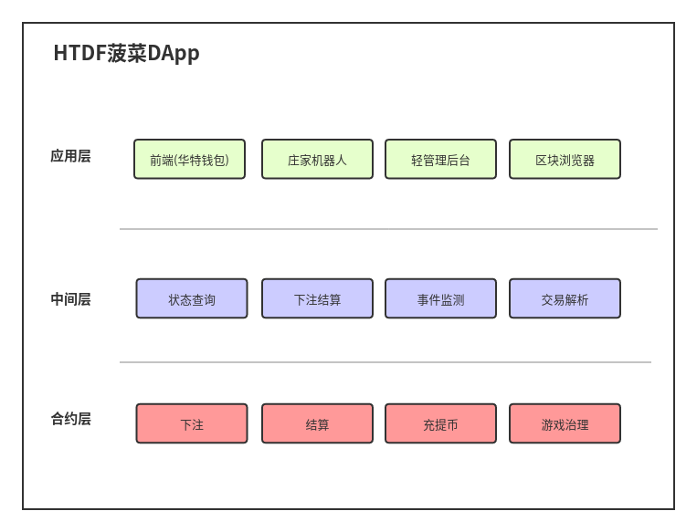

# HTDF




geth的console发送交易

```
eth.sendTransaction({'from':eth.accounts[0], 'to': "0x954d1a58c7abd4ac8ebe05f59191Cf718eb0cB89", 'value': web3.toWei(100, "ether")})
```


"ganache-cli": "^6.1.6",
    "mocha": "^5.2.0",
    "solc": "^0.4.25",
    "truffle-hdwallet-provider": "^1.0.1",
    "web3": "^1.0.0-beta.37"